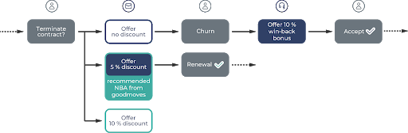
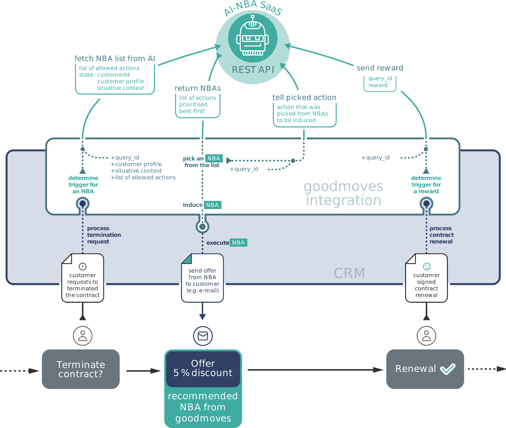

Version: 2.3.9

# Introduction
## Motivation

This document addresses developers and tech deciders who want to integrate goodmoves into the tools and systems they use and maintain.
As Software-as-a-Service, goodmoves brings the power of actual artificial intelligence to next best actions (NBA).
When communicating with a customer, be it through a webshop, an online marketing campaign or a phone call,
one faces a difficult challenge: customers should purchase a product, accept an upsell offer, or renew their contract.
No matter what situation a customer is in, there is one optimal course of action.

: A customer might consider cancelling a contract. No action is taken, so the customer terminates. At that point, a 10 % bonus is offered to win back the customer.")

Example case (traditional): A customer might consider cancelling a contract. No action is taken, so the customer terminates.
At that point, a 10 % bonus is offered to win back the customer.

In such situations, knowing the optimal next best action is invaluable. For example, based on past interactions, goodmoves
infers that an incentive needs to be offered to a certain type of customer to prevent churn.
But more than that, goodmoves can even suggest the necessary level of incentive and the channel through which it should be offered. 
This way, an automated email could be sent to the customer offering a not too small, yet not too large discount as a
motivation to renew the contract.

: Instead of initially not offering any discount followed by an expensive win-back bonus,
the first signs of contract termination trigger a discounted offer. goodmoves picks the best option from a list of possible
actions. Here, the algorithm has learned that a 5 % discount is the most profitable way to prevent this customer from churn.")

## Communication flow with goodmoves API
goodmoves uses reinforcement learning to learn about the customers’ behaviour and suggest the next best action.
This is achieved through a state-action-reward cycle. Here, the state represents the available information about a customer,
for which the decision (an action) has to be made. It consists of customer data like an ID, demographic information,
historic data (such as former purchases) and can be supplemented by additional features such as the time of day.

In the example case from the previous chapter, a customer is in danger of cancelling a contract. When requesting an
action for that customer to prevent churn, you send us the state. In addition, we need the list of allowed actions to
choose from, depending on the current circumstances. For instance, you might want to exclude actions that would not be
suitable for this customer due to company policies.

Based on the state, goodmoves responds with a prioritised list of actions for a given customer. These recommendations
let you know what the optimal next best action is. In our example, that means to offer a 5% discount on contract renewal.

To allow the goodmoves AI to learn from interactions, it needs to be made aware whether the selected action was successful
in practice. This is the reward. The machine learning algorithm immediately incorporates this feedback,
continuously improving its recommendations.
